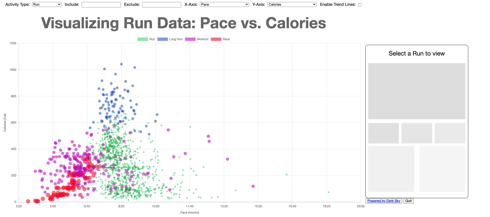

# Running Data Visualizer

### Uses the Strava and Darksky APIs to plot various metrics

### Feature Ideas:

-   [x] Improve file structure
-   [x] Make dropdown menus more modular/OO
-   [x] Add support for other activity types
-   [ ] Replace massive JSON file with an actual database
-   [ ] Add an actual readme file with pictures, descriptions etc.
-   [ ] Allow for annotations based on season/injuries/PRs
